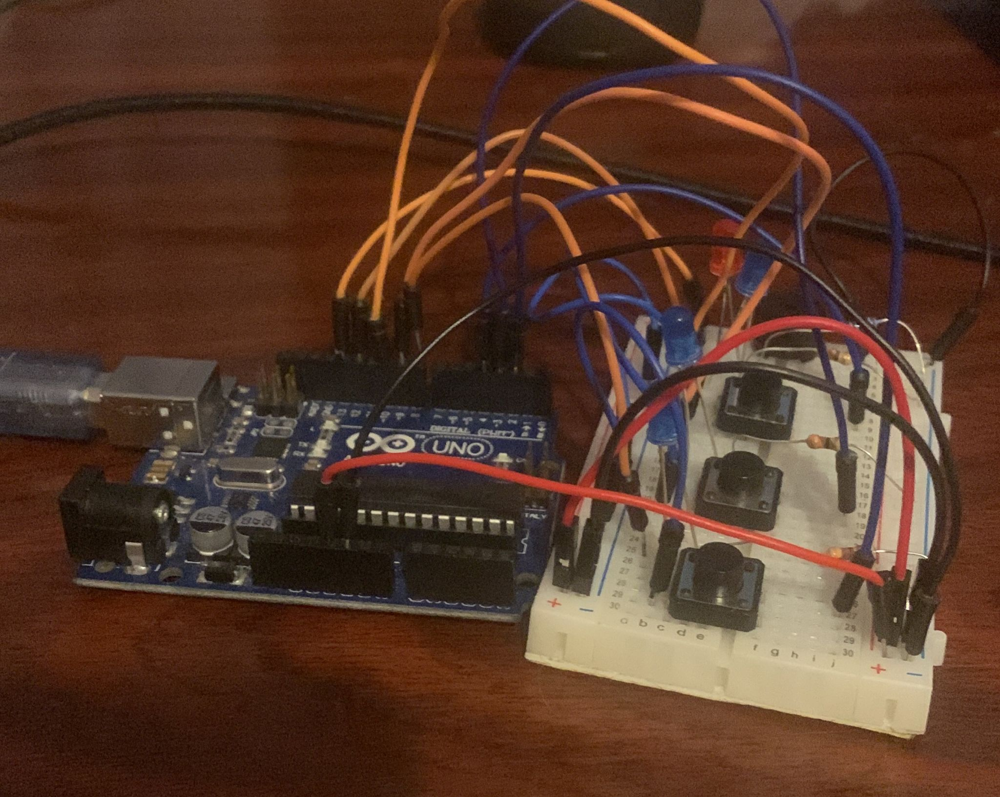

# Homework #2

## Task - Design a control system that simulates a 3-floor elevator using the Arduino platform. 

This assignment involves simulating a 3-floor elevator control system usingLEDs, buttons, and a buzzer with Arduino. By the end of this task, you will gain experience in using button state change, implementing debouncing techniques and coordinating multiple components to represent real-world scenarios.

## Requirements
- Arduino Uno
- 4 LEDs (3  for  the  floors  and  1  for  the  elevator’s  operational state)
- 3 Buttons (1 for each floor)
- 4 resistors (1 for each LED)
- 1 buzzer 
- wires

## Implementation details
- The 3 buttons are connected to the Arduino Uno board, each one to a digital pin (2, 3, 4).
- The 3 LEDs are connected to the Arduino Uno board, each one to a digital pin (8, 9, 10).
- The 4th LED is connected to the Arduino Uno board, to a digital pin (12).
- The buzzer is connected to the Arduino Uno board, to a digital pin (13).
- The code then checks if a button is pressed, and if so, it will light up the corresponding LED, and move the elevator to that floor. The tricky part is to make the elevator go through each floor in order, and not skip any floors.

## Code 
```c
const int floor1Button = 2;      // Button for Floor 1
const int floor2Button = 3;      // Button for Floor 2
const int floor3Button = 4;      // Button for Floor 3
const int floor1Led = 8;         // LED for Floor 1
const int floor2Led = 9;         // LED for Floor 2
const int floor3Led = 10;        // LED for Floor 3
const int reachedFloorLed = 12;  // LED to indicate reaching a floor
const int buzzerPin = 13;        // Buzzer


bool elevatorMoving = false;
int currentFloor = 1;
int targetFloor = 1;
unsigned long startTime = 0;
const unsigned long travelTime = 2500;   // Time it takes to travel between floors in milliseconds
const unsigned long debounceDelay = 50;  // Debounce time in milliseconds
unsigned long closeDoor = 0;             // Closing timer when pressing a button


bool debounce(int buttonPin) {
  static unsigned long lastDebounceTime = 0;
  static int lastButtonState = HIGH;
  int buttonState = digitalRead(buttonPin);
  unsigned long currentTime = millis();

  if (currentTime - lastDebounceTime > debounceDelay) {
    if (buttonState != lastButtonState) {
      lastDebounceTime = currentTime;
      lastButtonState = buttonState;

      if (buttonState == LOW) {
        return true;
      }
    }
  }

  return false;
}

void setup() {
  pinMode(floor1Button, INPUT_PULLUP);
  pinMode(floor2Button, INPUT_PULLUP);
  pinMode(floor3Button, INPUT_PULLUP);

  pinMode(floor1Led, OUTPUT);
  pinMode(floor2Led, OUTPUT);
  pinMode(floor3Led, OUTPUT);

  pinMode(reachedFloorLed, OUTPUT);
  pinMode(buzzerPin, OUTPUT);
  noTone(buzzerPin);

  digitalWrite(floor1Led, HIGH);  // Initialize by lighting up the first floor LED
}

void loop() {
  if (debounce(floor1Button) && !elevatorMoving) {
    closeDoor = millis();
    tone(buzzerPin, 659.25 / 2, 500);
    targetFloor = 1;
  }
  if (debounce(floor2Button) && !elevatorMoving) {
    closeDoor = millis();
    tone(buzzerPin, 659.25 / 2, 500);
    targetFloor = 2;
  }
  if (debounce(floor3Button) && !elevatorMoving) {
    closeDoor = millis();
    tone(buzzerPin, 659.25 / 2, 500);
    targetFloor = 3;
  }

  if (elevatorMoving) {
    unsigned long currentTime = millis();

    if (millis() - closeDoor > 500)
      tone(buzzerPin, 659.25 / 4, travelTime);

    if (currentTime - startTime >= travelTime) {
      elevatorMoving = false;
      digitalWrite(reachedFloorLed, HIGH);

      // Buzz the buzzer when reaching the floor
      if (currentFloor == targetFloor)
        tone(buzzerPin, 659.25 * 2, 500);

      digitalWrite(floor1Led, (currentFloor == 1) ? HIGH : LOW);
      digitalWrite(floor2Led, (currentFloor == 2) ? HIGH : LOW);
      digitalWrite(floor3Led, (currentFloor == 3) ? HIGH : LOW);

    } else {
      if (millis() - closeDoor > 500) {
        if ((currentTime - startTime) % 500 < 250) {
          digitalWrite(reachedFloorLed, LOW);
        } else {
          digitalWrite(reachedFloorLed, HIGH);
        }
      }
    }

  } else {
    // If the elevator is not moving, check if it needs to move (ifhml)
    if (currentFloor != targetFloor) {
      goToFloor(targetFloor);
    }
  }
}

void goToFloor(int floor) {
  if (currentFloor != floor) {
    digitalWrite(reachedFloorLed, LOW);
    startTime = millis();

    // update the floor
    if (currentFloor < floor)
      currentFloor++;
    if (currentFloor > floor)
      currentFloor--;

    elevatorMoving = true;
  }
}
```

## Code Difficulties

- One part was to make the elevator go through each floor in order, and not skip any floors. I solved this by using a variable to store the target floor, and then checking if the elevator is moving or not. If it is not moving, then it will check if the current floor is the same as the target floor, and if not, it will move to the target floor.
- The biggest issue i had was my lack of logic to work within a while true (void loop()), I tried to structure the code within functions, but encountered issues. Lesson learned, I need to adapt.

## Video
<a href="https://youtu.be/pl10T8YX4Jw" target="_blank"></a>

## Images

