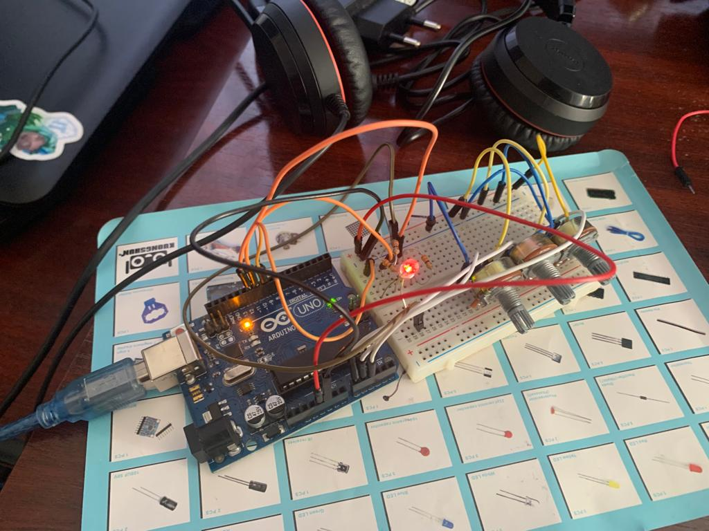
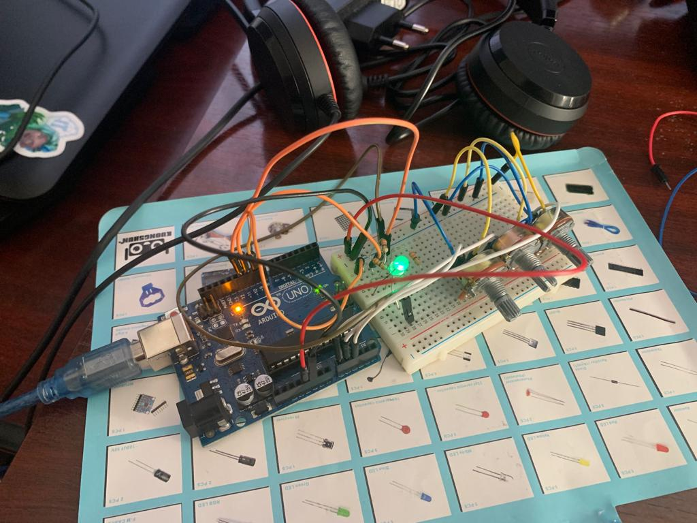

# Homework #2

## Task - RGB Led controlled by 3 potentiometers, each one for each color.
Use a separate potentiometer for controlling each color of the RGB LED:Red,Green, andBlue.  This control must leveragedigital electronics.  Specifically,you  need  to  read  the  potentiometer’s  value  with  Arduino  and  then  write a mapped value to the LED pins.

## Requirements
- Arduino Uno
- 3 potentiometers
- 1 RGB Led
- 3 resistors 
- wires

## Implementation details
- The 3 potentiometers are connected to the Arduino Uno board, each one to an analog pin (A0, A1, A2).
- The RGB Led is connected to the Arduino Uno board, each color to a digital pin (9, 10, 11).
- The 3 resistors are connected to the RGB Led.

## Code 
```c
const int redPin = 9;    // Red LED pin
const int greenPin = 10;  // Green LED pin
const int bluePin = 11;   // Blue LED pin

const int redPotPin = A0;    // Potentiometer for Red color
const int greenPotPin = A1;  // Potentiometer for Green color
const int bluePotPin = A2;   // Potentiometer for Blue color

void setup() {
  pinMode(redPin, OUTPUT);
  pinMode(greenPin, OUTPUT);
  pinMode(bluePin, OUTPUT);
}

void loop() {
  // Read the potentiometer values
  int redValue = analogRead(redPotPin);
  int greenValue = analogRead(greenPotPin);
  int blueValue = analogRead(bluePotPin);

  // Map the potentiometer values to the LED brightness (0-255)
  int redBrightness = map(redValue, 0, 1023, 0, 255);
  int greenBrightness = map(greenValue, 0, 1023, 0, 255);
  int blueBrightness = map(blueValue, 0, 1023, 0, 255);

  // Update the LED colors
  analogWrite(redPin, redBrightness);
  analogWrite(greenPin, greenBrightness);
  analogWrite(bluePin, blueBrightness);
}
```

## Video
[](https://youtu.be/34BXTwMJW_8)
<!-- make the video open in a new tab -->
<a href="https://youtu.be/34BXTwMJW_8" target="_blank"></a>

## Images




