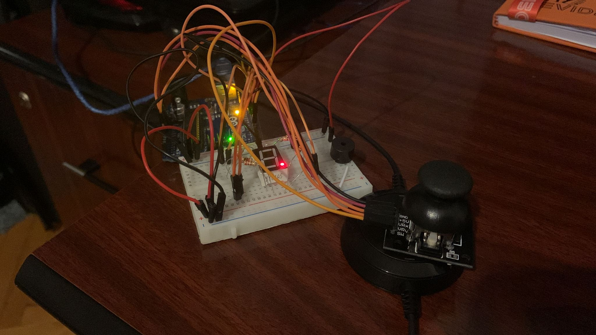

# Homework #3

## Task - Use a joystick to control a 7-segment display and "draw" on it.

In this assignment you will use the joystick to control the position ofthe segment and ”draw” on the display. The movement between segments should be natural, meaning they should jump from the current position only to neighbors, but without passing through ”walls”.

## Video

## Requirements
- Arduino Uno
- 7 segment display
- 8 resistors (1 for each segment)
- Joystick
- buzzer
- wires

## Implementation details
- The 7 segment display is connected to the Arduino Uno board, each segment to a digital pin (12-A, 10-B, 9-C, 8-D, 7-E, 6-F, 5-G, 4-DP).
- The joystick is connected to analog pins A0 (x-axis), A1 (y-axis), 2 (Sw), 5V (5V), GND (GND). The joystick moves left, right, up and down flickering the current led, upon pressing on the joystick the current LED lights up. If joystick button is held for more than 2 seconds everything resets. Starting position is the decimal point.
- The buzzer is connected to a digital pin 3. Buzzes when toggling a LED on or off and when reseting.
- wires

## Code Difficulties

- Not necessarily a difficulty, we had to use Interrupts for the button press, I couldn't figure it out so instead I used an interrupt function only to read the swState(when the joystick button is pressed).

## Images

