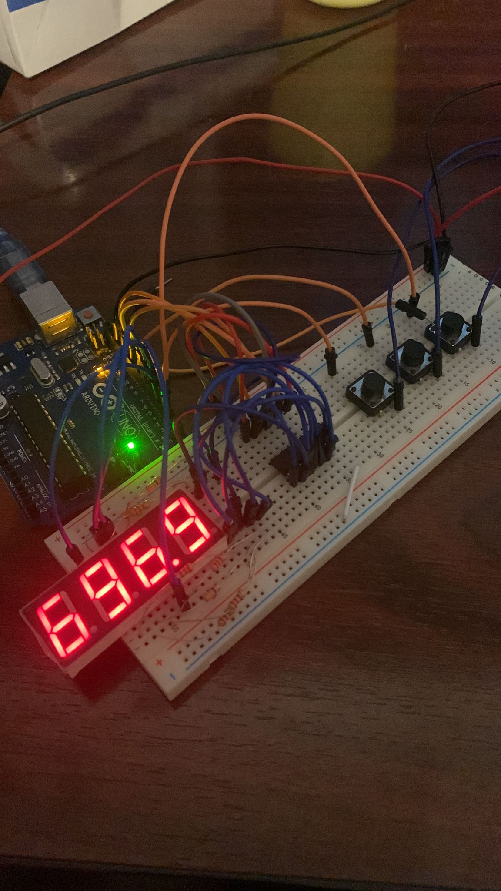

# Homework #4

## Task - Use a 4 Digit 7 Segment Display and a Shift Register to implement a stopwatch timer.

In this assignment, using the 4 digit 7 segment display and 3 buttons, you should implement a stopwatch timer that counts in 10ths of a second and has a save lap functionality (similar to most basic stopwatch functionson most phones).

1. Display shows ”000.0”.  When pressing theStartbutton, the timer should start.

2. During timer counter, each time you press the lap button, you should save that timer’s value in memory (not persistent, it is OK to be deleted upon reset), up to 4 laps (or more if you want); pressing the 5th time should override the 1st saved one. If you press the resetbutton while timer works, nothing happens. If you press the pausebutton, the timer stops.

3. In Pause Mode, the lap flag button doesn’t work anymore. Pressing the reset button resets you to 000.0.

4. After reset, you can now press the flag buttons to cycle through the lap times. Each time you press the flag button, it takes you to the next saved lap. Pressing it continuously should cycle you through it continuously. Pressing the reset button while in this state resets all your flags and takes the timer back to ”000.0”.

## Requirements
- Arduino Uno
- 4 digit 7 segment display
- 1 shift register
- 3 buttons
- buzzer
- 8 resistors 
- wires


## Implementation details
- The 4 digit segment display is connected to the Arduino board as follows (Arduino Pin, Display Pin): (4, D1), (5, D2), (6, D3), (7, D4). 
- The shift register is connected to the Arduino board as follows (Arduino Pin, Shift Register Pin): (10, SHCP), (11, STCP), (12, DS), (GND, GND), (5V, VCC), (5V, MR), (GND, OE).
- The 4 digit segment display is connected to the shift register as follows (Display Pin, Shift Register Pin): (A, Q7), (B, Q6), (C, Q5), (D, Q4), (E, Q3), (F, Q2), (G, Q1), (DP, Q0). *Use 220/330 ohm resistors!*
- The buttons are connected to the Arduino board as follows (Arduino Pin, Button Pin): (2, Start/Stop), (3, Lap), (8, Reset).
- The buzzer is connected to the Arduino board (13, Buzzer).

## Code 
```c
// Define connections to the shift register
const int latchPin = 11;  // Connects to STCP (latch pin) on the shift register
const int clockPin = 10;  // Connects to SHCP (clock pin) on the shift register
const int dataPin = 12;   // Connects to DS (data pin) on the shift register
// Define connections to the digit control pins for a 4-digit display
const int segD1 = 4;
const int segD2 = 5;
const int segD3 = 6;
const int segD4 = 7;
// Store the digits in an array for easy access
int displayDigits[] = { segD1, segD2, segD3, segD4 };
const int displayCount = 4;  // Number of digits in the display
// Define the number of unique encodings (0-9, A-F for hexadecimal)
const int encodingsNumber = 10;
// Define byte encodings for the hexadecimal characters 0-9
byte byteEncodings[encodingsNumber] = {
  //A B C D E F G DP
  B11111100,  // 0
  B01100000,  // 1
  B11011010,  // 2
  B11110010,  // 3
  B01100110,  // 4
  B10110110,  // 5
  B10111110,  // 6
  B11100000,  // 7
  B11111110,  // 8
  B11110110,  // 9
};

// Variables for controlling the display update timing
unsigned long lastIncrement = 0;
unsigned long delayCount = 100;  // Delay between updates (milliseconds)
unsigned long number = 0;        // The number being displayed

const int startStopButton = 2;
const int lapButton = 3;
const int resetButton = 8;
const int buzzerPin = 13;

volatile bool displayRunning = false;
unsigned long currentTime = millis();

const int lapArraySize = 4;
int lapTimes[lapArraySize];
int lapIndex = 0;

static unsigned long lastLapButtonPressTime = 0;
static bool lapButtonState = HIGH;  // HIGH means not pressed, LOW means pressed
const int buzzerFrec = 440;
const int buzzerDuration = 100;

void setup() {
  // Initialize the pins connected to the shift register as outputs
  pinMode(latchPin, OUTPUT);
  pinMode(clockPin, OUTPUT);
  pinMode(dataPin, OUTPUT);
  // Initialize digit control pins and set them to LOW (off)
  for (int i = 0; i < displayCount; i++) {
    pinMode(displayDigits[i], OUTPUT);
    digitalWrite(displayDigits[i], LOW);
  }

  pinMode(startStopButton, INPUT_PULLUP);
  attachInterrupt(digitalPinToInterrupt(startStopButton), buttonInterrupt, CHANGE);

  pinMode(lapButton, INPUT_PULLUP);
  attachInterrupt(digitalPinToInterrupt(lapButton), lapButtonInterrupt, CHANGE);

  pinMode(resetButton, INPUT_PULLUP);

  pinMode(buzzerPin, OUTPUT);

  // Begin serial communication for debugging purposes
  Serial.begin(9600);
}

void loop() {
  if (displayRunning) {
    // Increment the number and update the display only if it's allowed to run
    if (millis() - lastIncrement > delayCount) {
      number++;
      number %= 10000;  // Wrap around after 9999
      lastIncrement = millis();
    }
    // Display the incremented number on the 7-segment display using multiplexing
  }
  writeNumber(number);
  if (digitalRead(resetButton) == LOW) {
    tone(buzzerPin, buzzerFrec, buzzerDuration);
    number = 0;
    displayRunning = false;
    lastIncrement = millis();
  }
}


void lapButtonInterrupt() {
  // Interrupt handler for the lap button
  tone(buzzerPin, buzzerFrec, buzzerDuration);

  int lapButtonReading = digitalRead(lapButton);

  if (lapButtonReading != lapButtonState) {
    // Update the button state if it has changed
    lastLapButtonPressTime = currentTime;
    lapButtonState = lapButtonReading;

    // Process the button press only if it's a LOW (pressed) state
    if (lapButtonState == LOW && displayRunning) {
      recordLapTime(number);
    } else if (lapButtonState == LOW && !displayRunning) {
      displayLapTime();
    }
  }
}

void recordLapTime(int number) {
  // Record lap time
  lapTimes[lapIndex] = number;
  lapIndex = (lapIndex + 1) % lapArraySize;
}

void displayLapTime() {
  // Display lap time
  number = lapTimes[lapIndex];
  lapIndex = (lapIndex + 1) % lapArraySize;
  writeNumber(number);
}

void buttonInterrupt() {
  // Interrupt handler for the button
  tone(buzzerPin, buzzerFrec, buzzerDuration);
  // Toggle the state of displayRunning when the button is pressed
  if (digitalRead(startStopButton) == LOW) {
    displayRunning = !displayRunning;
    lastIncrement = millis();
  }
}

void writeReg(int digit) {
  // Prepare to shift data by setting the latch pin low
  digitalWrite(latchPin, LOW);
  // Shift out the byte representing the current digit to the shift register
  shiftOut(dataPin, clockPin, MSBFIRST, digit);
  // Latch the data onto the output pins by setting the latch pin high
  digitalWrite(latchPin, HIGH);
}

void activateDisplay(int displayNumber) {
  // Turn off all digit control pins to avoid ghosting
  for (int i = 0; i < displayCount; i++) {
    digitalWrite(displayDigits[i], HIGH);
  }
  // Turn on the current digit control pin
  digitalWrite(displayDigits[displayNumber], LOW);
}

void writeNumber(int number) {
  // Initialize necessary variables for tracking the current number and digit position
  int currentNumber = number;
  int displayDigit = 3;  // Start with the least significant digit
  int lastDigit = 0;
  int decimalPoint = 1;  // The position of the decimal point, starting from the right

  // Loop through each digit of the current number
  while (currentNumber != 0 || displayDigit >= 0) {
    // Extract the last digit of the current number
    lastDigit = currentNumber % 10;

    // Activate the current digit on the display
    activateDisplay(displayDigit);

    // Output the byte encoding for the last digit to the display
    if (displayDigit == 2) {
      // Set the decimal point for the third digit (seconds)
      writeReg(byteEncodings[lastDigit] + 1);
    } else {
      // Output the byte encoding without the decimal point
      writeReg(byteEncodings[lastDigit]);
    }

    // Move to the next digit and adjust the decimal point position
    displayDigit--;
    decimalPoint++;

    // Update 'currentNumber' by removing the last digit
    currentNumber /= 10;

    // Clear the display to prevent ghosting between digit activations
    writeReg(B00000000);  // Clear the register to avoid ghosting
  }
}

```

## Code Difficulties

- I did not have any difficulties with this assignment.

## Video
<a href="https://youtu.be/vjKBlgXtpJw" target="_blank"></a>

## Images

