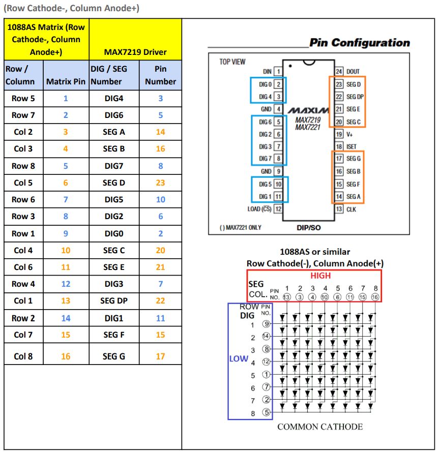
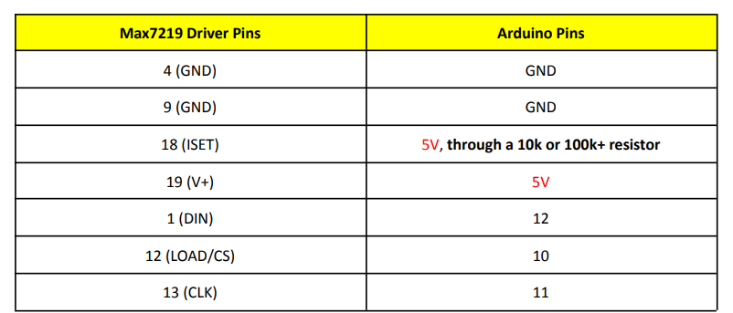
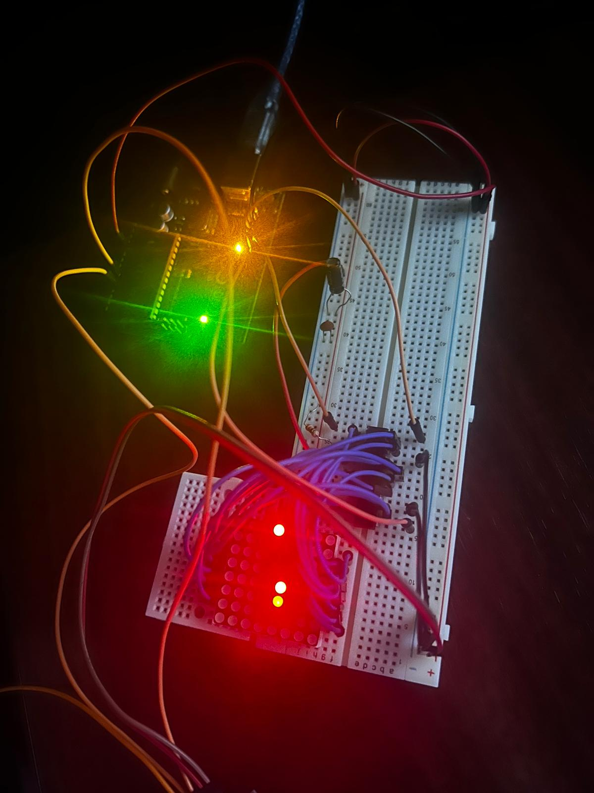

# Homework #3

## Task - Mini Matrix Game - Develop a small game on the 8x8 matrix.

## Video
<a href="https://youtube.com/shorts/kqCikBWXxaM" target="_blank"></a>

## Requirements
- Arduino Uno
- 8x8 LED Matrix
- MAX7219 Driver
- Joystick
- 1 resistor
- 1 big condenser & 1 small condenser
- wires

## Implementation details
# Connect the Matrix to the Driver:


# Connect the Driver to the Arduino:


## Code Difficulties

- Implementing the snake movement logic:
    - The snake is an array of coordinates:
        ```c
        int snakeX[snakeLength];
        int snakeY[snakeLength];
        ```
    - The head of the snake is the first element of the array:
        ```c
        snakeX[0];
        snakeY[0];
        ```
    - The snake moves by adding a new head based on direction:
        ```c
        // In this example the directions are swapped so that it is easier to use with my joystick position
        // Default:
        // RIGHT: snakeX[0]++;
        // LEFT:  snakeX[0]--;
        // UP:    snakeY[0]++;
        // DOWN:  snakeY[0]--;
        switch (snakeDirection) {
            case RIGHT:
              snakeY[0]--;
              break;
            case LEFT:
              snakeY[0]++;
              break;
            case UP:
              snakeX[0]++;
              break;
            case DOWN:
              snakeX[0]--;
              break;
            }
        ```
    - And by removing the tail:
        ```c
        snakeX[i] = snakeX[i - 1]; 
        snakeY[i] = snakeY[i - 1];
        ```

    - Wrapping the snake through the edges of the matrix:
        ```c
        snakeX[0] = (snakeX[0] + matrixSize) % matrixSize;
        snakeY[0] = (snakeY[0] + matrixSize) % matrixSize;
        ```

## Images

